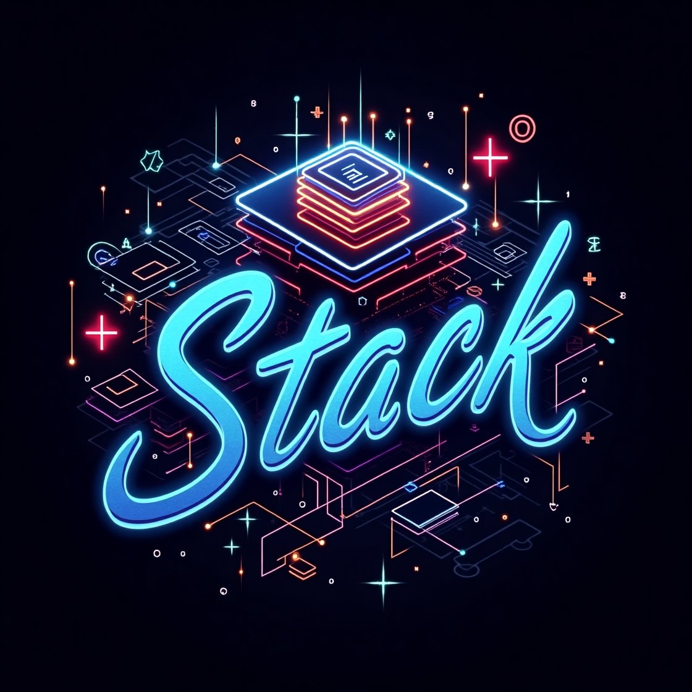

<div align="center">
  
  
  # 🛡️ Stack Implementation in C (C++)
  
  
  
</div>

## 🚀 Quick Start
To build the project:
```cpp
git clone https://github.com/BulgakovDmitry/stack
cd stack
make clean && make run
./structStack.out
```


## 🔍 Overview
Structure definition:
```cpp
struct Stack_t
{
    S_CAN_PR(Canary_t leftStackCanary;)  // Left canary (enabled with canary protection)

    size_t   coefCapacity;
    uint64_t errorStatus;

    StackElem_t* data;
    size_t       size;
    size_t       capacity;

    S_CAN_PR(Canary_t rightStackCanary;) // Right canary (enabled with canary protection)
};
```

| Implementation Feature       | Purpose                        |
|-------------------------|-----------------------------------|
| `Canaries`             | Detect buffer overflows     |
| `Verifier`             | Check stack integrity       |
| `POISON values`        | Detect uninitialized access |
| `Detailed dump`        | Error state visualization   |

## 📂 Project Structure
```
stack/
├── headers/            # Header files
│   ├── stack.hpp       # Stack interface
│   └── configFile.hpp  # Protection settings
├── src/                # Source code
│   ├── stack.cpp       # Stack implementation
│   └── main.cpp        # Usage example
└── myLib/              # Helper library
```

## 💡 Usage example:
```cpp
#include "../headers/stack.hpp"

int main(void)
{
    Stack_t stk = {};
    stackCtor(&stk);    // Initialize the stack
    
    stackPush(&stk, 5);
    stackPush(&stk, 6);
    stackPush(&stk, 7);
    
    stackPop(&stk);
    
    stackDump(stk);   // Print stack state
    stackDtor(&stk);  // Destructor call
    return 0;
}
```

<div align="center">
  
</div>
